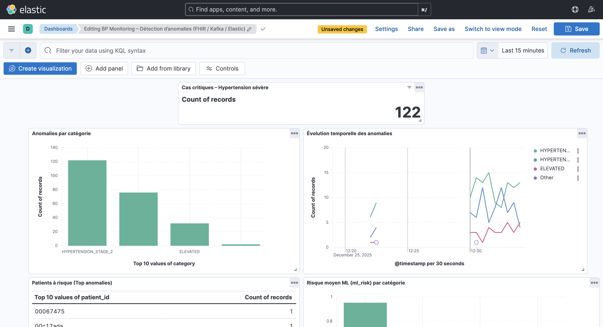
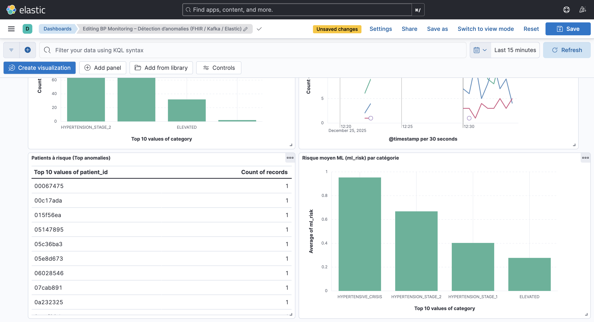

# BP Monitoring — Kafka + FHIR + Elasticsearch + Kibana (Docker)

## Contexte
Surveillance des patients via leurs mesures de pression artérielle (blood pressure) afin de détecter rapidement des situations anormales.
Le format des messages suit le standard HL7 FHIR (ressource Observation), envoyé en JSON.

Références :
- FHIR overview : https://www.hl7.org/fhir/overview.html
- Exemple Observation BP : https://build.fhir.org/observation-example-bloodpressure.json.html

## Objectif général
1) Générer des messages FHIR Observation (pression artérielle) en JSON  
2) Publier les messages dans Kafka  
3) Consommer les messages, détecter les anomalies (seuils cliniques)  
4) Indexer les anomalies dans Elasticsearch  
5) Visualiser les anomalies dans Kibana  
6) Archiver les mesures normales localement

## Architecture
Producer (Python) -> Kafka -> Consumer (Python: règles + traitement) -> Elasticsearch -> Kibana
                                     |
                                     -> Archivage local (JSONL)

## Détection d’anomalies (règles)
- NORMAL : sys < 120 ET dia < 80
- ELEVATED : 120–129 ET dia < 80
- HTA Stage 1 : 130–139 OU 80–89
- HTA Stage 2 : >= 140 OU >= 90
- CRISIS : > 180 OU > 120

## Stack Docker
- Apache Kafka 3.7.0
- Elasticsearch + Kibana 8.15.x
- kafka-ui (monitoring Kafka)
- Producer/Consumer Python

## Résultats et validation

Le pipeline Kafka → Elasticsearch → Kibana fonctionne en continu.
Les anomalies détectées sont indexées dans l’index `bp-anomalies`.

Validation effectuée par :
- Vérification des conteneurs Docker actifs (`docker compose ps`)
- Présence de messages dans Kafka (Kafka UI)
- Index Elasticsearch alimenté
- Visualisation des anomalies dans Kibana

## Lancement
Depuis le dossier du projet :
```bash
docker compose up -d --build
docker compose ps
```

## Dashboard Kibana

Un dashboard Kibana a été construit afin de superviser les anomalies détectées :

- V1 : Répartition des anomalies par catégorie clinique
- V2 : Évolution temporelle des anomalies
- V3 : Nombre de cas critiques (HTA sévère)
- V4 : Patients les plus à risque (Top anomalies)


Le dashboard permet une surveillance quasi temps réel des situations à risque.

### Aperçu visuel du dashboard

#### Vue globale des anomalies


#### Analyse avancée (ML & patients à risque)


## Limites et perspectives

- Les données sont synthétiques (simulation)
- Les règles de détection sont déterministes
- L’export PDF du dashboard n’est pas disponible dans l’infrastructure Docker locale

Perspectives :
- Ajout d’un score probabiliste (Machine Learning)
- Enrichissement des données patient
- Déploiement sur une infrastructure distante

## Bonus Machine Learning

Un score probabiliste `ml_risk` ∈ [0,1] est calculé dans le consumer à l’aide
d’une fonction logistique basée sur les valeurs systolique et diastolique.
Ce score complète les règles cliniques déterministes et est visualisé
dans Kibana.
---

## Dépendances Python

⚠️ Le projet est conçu pour être exécuté via **Docker**.

Les dépendances sont installées automatiquement dans chaque conteneur via :
- `producer/requirements.txt`
- `consumer/requirements.txt`

Un fichier `requirements.txt` est également présent à la racine
à titre **informatif** pour la lecture du projet.
